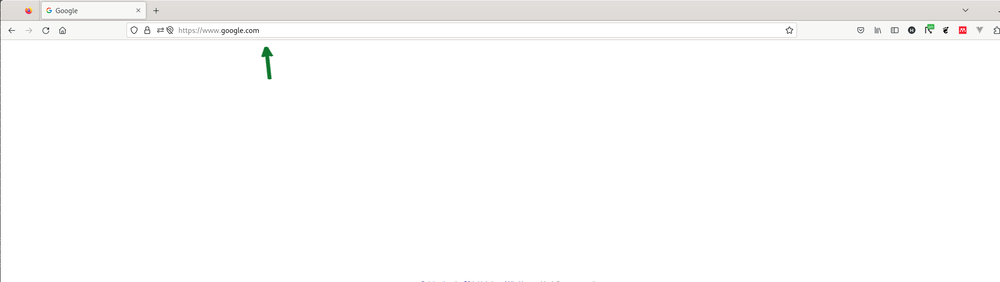
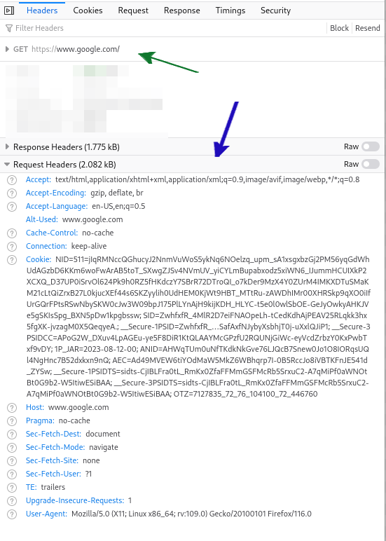
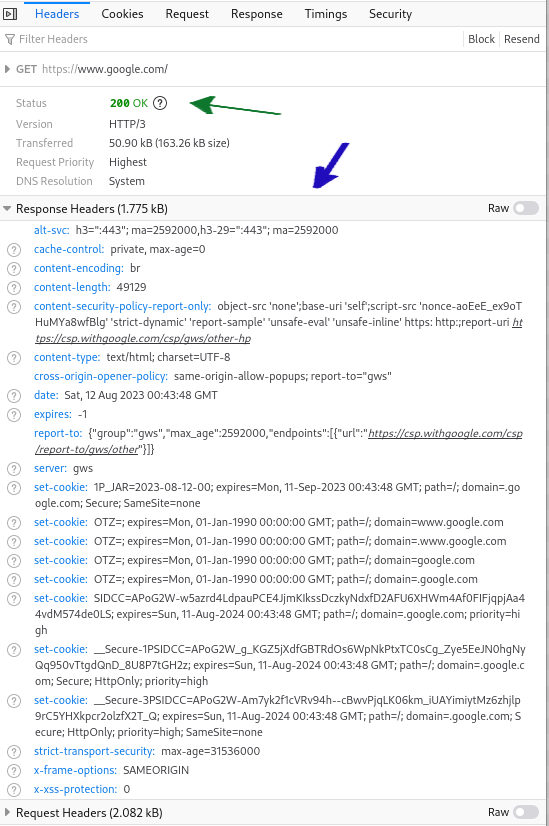
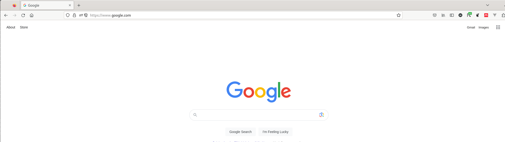
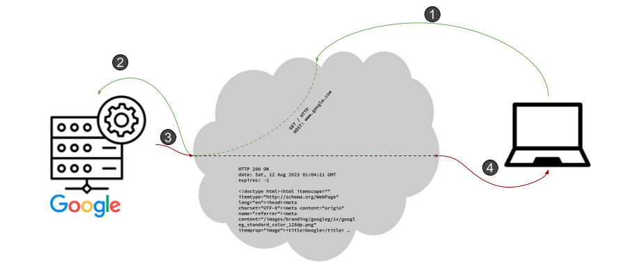

### Express Yourself

One of the coolest things about the Internet is that you don't have to ask anyone's permission to put a website online. With an Internet connection and a computer, you, too, can host content for others to check out! The Internet connection is required so that people who want to view your website are able to access your _server_, a computer that will respond to client requests for content, from their Internet-connected device (laptop, desktop, cell phone).

We learned in the [api_intro]() tutorial that one of the the ways a client requests content from a computer is with the [HTTP protocol](https://developer.mozilla.org/en-US/docs/Web/HTTP) (yes, that _is_ redundant -- the _P_ in HTTP stands for protocol, after all). Again, you may remember from the [api_intro]() tutorial that the request for content in the HTTP is formatted as a so-called [`GET`](https://developer.mozilla.org/en-US/docs/Web/HTTP/Methods/GET) request. The software running on the computer of the person that wants to view your website (usually their web browser) puts the name of the particular resource that they want to _get_ in the `GET` request. The _server_ software reads the contents of the `GET` request, prepares a response (a process we will discuss here in _great_ depth), and then sends that response back to the person requesting.

Structuring content access (or invocation of an API) in this manner is known as a _client-server_ architecture. The server software is, er, the server. The person running the web browser and requesting content from the server is known as the client. Let's say that you are running a client (the Firefox web browser) and you are attempting to access Google to run a search. The resource that you are accessing from Firefox, your client, is known as `index.html` -- that is the name of the file containing the HTML your client will fetch from a server when you don't give it anything more specific.



Notice the text where the green arrow is pointing: `https://www.google.com/`. The `www.google.com` piece describes a host on the Internet -- in other words, it names a server. That is the place where the client connects to send their GET request. The `https` specifies the protocol (sometimes also referred to as the _scheme_). The `s` stands for secure and means that the communication between the client and the server are encrypted and they are are the only two that can read the information sent between them. Everything after the `/` after the `.com` specifies a _path_. It is the job of the server to interpret the meaning of a path and to fetch the requested resource to send back to the client. Because there is no path here -- everything after the `/` is blank -- the server falls back on its configuration to determine the resource to load and send back to the client (that's where the `index.html` comes from although we could have [configured the server](https://httpd.apache.org/docs/2.4/mod/mod_dir.html) any way that we liked).

Although you do _not_ need to know the details of how the client formats the request and the server formats the response, it is fun to see that there's nothing that special happening. Here is a snippet of the request that your client makes when you access Google:



You can see the basics of the `GET` request indicated by the green arrow. The client sends additional information with the request, too, that will help the server respond in a way that is especially tailored for the client (these parameters can define things like the format of the characters that your computer can display, etc.) These parameters are sent in [_request headers_](https://developer.mozilla.org/en-US/docs/Web/HTTP/Headers) and you can see the ones that Firefox sets when requesting the Google homepage (blue arrow).

Once the server has done its work to generate the response (for a server running a website, the response is usually sent back to the client as an HTML document sprinkled with some JavaScript), the response is transmitted back to the client. In the diagram below, you can see the _response headers_ sent by the server below.



The `200/OK` (highlighted by the green arrow) is known as a [_response status code_](https://developer.mozilla.org/en-US/docs/Web/HTTP/Status) for an HTTP response and helps the client understand whether the server was able to correctly handle the request. `200/OK` indicates, as you can imagine, that everything was okay on the server and a response was properly generated. There is another very famous HTTP status code that you might have seen before: `404/Not Found`. That indicates to the client that the server was not able to find the resource that the client requested. As with the request, there are some specific headers in the response. Those are shown with the blue arrow.

And now, finally, the actual contents of the webpage is transferred. The start of the contents of the Google homepage looks something like:

```HTML
<!doctype html><html itemscope="" itemtype="http://schema.org/WebPage" lang="en"><head><meta charset="UTF-8"><meta content="origin" name="referrer"><meta content="/images/branding/googleg/1x/googleg_standard_color_128dp.png" itemprop="image"><title>Google</title>
...
```

The contents are formatted in a language called the _hypertext markup language_, HTML. HTML is a language for statically defining the layout of elements on a screen. Most web developers combine HTML with [CSS](https://en.wikipedia.org/wiki/CSS), _cascading style sheets_, and JavaScript. CSS provides an advanced way for web developers to _style_ (go figure!) their web pages and the JavaScript provides a way for the web developers to make their sites dynamic (either by facilitating interaction with the user, downloading new content on demand (e.g., the latest prices of stocks of interest) or moving elements around on the screen.) The job of the web browser is to handle the relationships and interplay between those three elements and _render_, display, a webpage on the screen.



It's really amazing to realize that for all the magic, the Internet is really quite simple and it is relatively easy to peel back the abstraction and see what is happening.



The diagram above is a recap of each of the pieces of the process described above. Steps (1) and (2) in the diagram above show, schematically, what happens when the client connects to the server and requests content using HTTP. After the server generates a response, it is packaged up (into a different HTTP message) and then sent back to the client (Steps (3) and (4)). When the client receives the response, it converts the textual description of the formatting (the HTML) into images and words on the screen in the browser.

